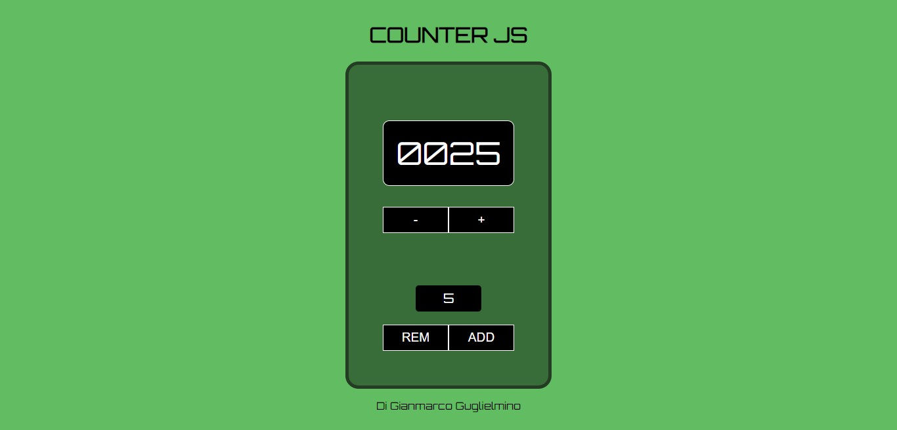

<!-- PROJECT LOGO -->
 

  

<h3 align="center">Progetto Counter JavaScript di Gianmarco Guglielmino</h3>

  

     
    <a href="https://github.com/Jim2510/Counter"><strong>Explore the docs »</strong></a>
     
     
    <a href="https://jim2510.github.io/Counter/">View Demo</a>
    ·
    <a href="https://github.com/Jim2510/Counter/issues">Report Bug</a>
    ·
    <a href="https://github.com/Jim2510/Counter/issues">Request Feature</a>
  

<!-- TABLE OF CONTENTS -->

  
Table of Contents

  <ol>
    <li>
      <a href="#about-the-project">About The Project</a>
      <ul>
      <li><a href="#features">Features</a></li>
        <li><a href="#built-with">Built With</a></li>
      </ul>
    </li>
    <li><a href="#gettin-starter">Gettin starter</a></li>
    <ul>
    <li><a href="#how-to-use">How to use</a></li>
    </ul>
    <li><a href="#roadmap">Roadmap</a></li>
    <li><a href="#contributing">Contributing</a></li>
    <li><a href="#contact">Contact</a></li>
  </ol>

<!-- ABOUT THE PROJECT -->
## About The Project

 

Questo progetto rappresenta una semplice applicazione web che permette di incrementare o decrementare un valore numerico tramite pulsanti. E' possibile specificare un valore da aggiungere o rimuovere e il contatore verrà aggiornato di conseguenza. Il valore massimo raggiungibile è 9999 mentre il valore minimo è 0.

(<a href="#readme-top">back to top</a>)

### Features
* Creazione e Visualizzazione dei pulsante +, -, add, rem e reset
* Incrementa il contatore di uno alla volta premendo il pulsante "+".
* Decrementa il contatore di uno alla volta premendo il pulsante "-".
* Puoi specificare un valore da aggiungere o rimuovere utilizzando l'input numerico.
* Il contatore viene visualizzato con quattro cifre, utilizzando gli zeri iniziali, ad esempio "0000".
* Il valore massimo raggiungibile è 9999.
* Il pulsante "-" viene disabilitato quando il contatore è a 0 per evitare valori negativi.

(<a href="#readme-top">back to top</a>)

### Built With

* HTML
* CSS
* SASS
* JAVASCRIPT

(<a href="#readme-top">back to top</a>)

 

<!-- GETTING STARTED -->
## Getting Started

<!-- USAGE EXAMPLES -->
### How to use

* Clona o scarica il repository su una cartella locale.
* Apri il file index.html nel tuo browser preferito.

(<a href="#readme-top">back to top</a>)

<!-- ROADMAP -->
## Roadmap

Versione 1.0:

* Implementazione di un counter funzionante con incremento e decremento di valore.
* Aggiunta della funzionalità di inserimento di un numero personalizzato da aggiungere o rimuovere.
* Aggiunta della limitazione del counter massimo a 9999.
* Implementazione delle verifiche per evitare il decremento quando il counter è già a zero.
* Aggiunta di stile e formattazione al counter per renderlo più visivamente accattivante.
* Creazione di un file README per fornire istruzioni sull'utilizzo e la contribuzione al progetto.

(next release)

Versione 1.1:
* Implementazione di un input che permetterà di scegliere il valore predefinito assegnato ai pulsanti +/-.

(<a href="#readme-top">back to top</a>)

<!-- CONTRIBUTING -->
## Contributing

Le contribuzioni sono ciò che rende la comunità open source un luogo straordinario per imparare, ispirare e creare. Qualsiasi contributo che fai è **molto apprezzato**.

Se hai suggerimenti per migliorare, ti invito a fare il fork della repository e creare un pull request. Puoi anche aprire semplicemente una issue con il tag "miglioramento". Non dimenticare di dare una stella al progetto! Grazie ancora!

1. Effettua il fork al progetto
2. Crea il tuo Feature Branch (`git checkout -b feature/NewFeature`)
3. Esegui il commit (`git commit -m 'Add some NewFeature'`)
4. effettua il push al branch (`git push origin feature/NewFeature`)
5. Apri una Pull Request

(<a href="#readme-top">back to top</a>)

<!-- CONTACT -->
## Contact

Gianmarco Guglielmino - gmguglielmino@gmail.com

Github: [Jim2510](https://github.com/Jim2510)

(<a href="#readme-top">back to top</a>)

<!-- ACKNOWLEDGMENTS -->
## Acknowledgments

* 
* 
* 

(<a href="#readme-top">back to top</a>)

<!-- MARKDOWN LINKS & IMAGES -->
<!-- https://www.markdownguide.org/basic-syntax/#reference-style-links -->
<!-- [contributors-shield]: https://img.shields.io/github/contributors/github_username/repo_name.svg?style=for-the-badge
[contributors-url]: https://github.com/github_username/repo_name/graphs/contributors
[forks-shield]: https://img.shields.io/github/forks/github_username/repo_name.svg?style=for-the-badge
[forks-url]: https://github.com/github_username/repo_name/network/members
[stars-shield]: https://img.shields.io/github/stars/github_username/repo_name.svg?style=for-the-badge
[stars-url]: https://github.com/github_username/repo_name/stargazers
[issues-shield]: https://img.shields.io/github/issues/github_username/repo_name.svg?style=for-the-badge
[issues-url]: https://github.com/github_username/repo_name/issues
[license-shield]: https://img.shields.io/github/license/github_username/repo_name.svg?style=for-the-badge
[license-url]: https://github.com/github_username/repo_name/blob/master/LICENSE.txt
[linkedin-shield]: https://img.shields.io/badge/-LinkedIn-black.svg?style=for-the-badge&logo=linkedin&colorB=555
[linkedin-url]: https://linkedin.com/in/linkedin_username
[product-screenshot]: images/screenshot.png
[Next.js]: https://img.shields.io/badge/next.js-000000?style=for-the-badge&logo=nextdotjs&logoColor=white
[Next-url]: https://nextjs.org/
[React.js]: https://img.shields.io/badge/React-20232A?style=for-the-badge&logo=react&logoColor=61DAFB
[React-url]: https://reactjs.org/
[Vue.js]: https://img.shields.io/badge/Vue.js-35495E?style=for-the-badge&logo=vuedotjs&logoColor=4FC08D
[Vue-url]: https://vuejs.org/
[Angular.io]: https://img.shields.io/badge/Angular-DD0031?style=for-the-badge&logo=angular&logoColor=white
[Angular-url]: https://angular.io/
[Svelte.dev]: https://img.shields.io/badge/Svelte-4A4A55?style=for-the-badge&logo=svelte&logoColor=FF3E00
[Svelte-url]: https://svelte.dev/
[Laravel.com]: https://img.shields.io/badge/Laravel-FF2D20?style=for-the-badge&logo=laravel&logoColor=white
[Laravel-url]: https://laravel.com
[Bootstrap.com]: https://img.shields.io/badge/Bootstrap-563D7C?style=for-the-badge&logo=bootstrap&logoColor=white
[Bootstrap-url]: https://getbootstrap.com
[JQuery.com]: https://img.shields.io/badge/jQuery-0769AD?style=for-the-badge&logo=jquery&logoColor=white
[JQuery-url]: https://jquery.com -->